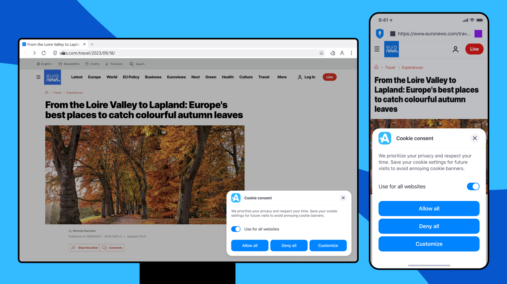

# Cookie Consent Management

## Motivation

Current regulations require websites to present EU users with cookie consent dialogs, aiming to enhance privacy. However, this approach is often inconvenient for both users and websites. Users commonly block these dialogs with ad-blocking lists like "I don't care about cookies," which, while effective at hiding pop-ups, fail to offer granular control over cookie acceptance, rejection, or selective preferences.

Aloha proposes a shift to browser-level consent management, enabling a more user-centric and efficient privacy solution. This approach simplifies consent handling, allows for global and site-specific settings, and standardizes cookie categories for consistent user experience, while ensuring compliance and providing better control over third-party cookie interactions.

## Key features of the proposed standard

1. Browser-level consent management:
    * Move consent controls from individual websites to the browser settings.
    * Eliminate the need for per-site cookie banners and popups.
2. Global consent options:
    * "Allow all" cookies
    * "Reject all" cookies
    * Custom settings for different cookie categories (e.g., necessary, functional, analytics, advertising)
3. Per-site granular settings:
    * Users can customize their cookie preferences for specific websites.
    * Ability to override global settings on a site-by-site basis.
4. Standardized cookie categories:
    * Define a common set of cookie categories across all websites.
    * Ensure consistency in how cookies are classified and presented to users.
5. Consent storage and communication:
    * Browsers store user consent preferences securely.
    * Implement a standardized API for websites to query the user's consent status.
6. Audit trail and compliance:
    * Maintain a log of consent changes for GDPR compliance.
    * Provide tools for users to review and modify their consent history.
7. Proactive reaction:
    * Based on the user choice, the browser can decide how to react to third party cookies and may block cookie requests from malicious websites.

## Proposed Solution Details

### The workflow

**1\. User Website Access:**

Upon a user's visit to a website, the **website** initiates the consent management process.

**2\. Browser Capability Check:**

The **website** queries the **browser** to determine if it supports advanced cookie management features.

* If the **browser** lacks support, the **website** displays a standard cookie consent dialog as per conventional practices.
* If the **browser** supports cookie management features, the **website** retrieves the user’s stored cookie preferences from the browser.

**5\. Browser Consent Dialog:**

If needed, the browser displays a consent dialog to the user, incorporating the information provided by the website about the specific cookie categories.



**6\. User Choice Communication:**

The user's consent decision is communicated back to the website, which then applies the chosen settings to the website’s operation.

**7\. Future Visit Preferences:**

The browser may store the user's decision for future interactions with the website. In subsequent visits, the browser may use the "allowCustom" preference to relay the saved settings back to the website, streamlining the consent process.

### Mandatory Part

### Specification for `cookiesConsentManager` Object

The `cookiesConsentManager` object is introduced in the `globalThis` (`windows` in browser) scope to allow websites to interact with user-defined cookie preferences. It provides a standardized way to handle consent directly from the browser, giving users greater control over their privacy while maintaining compliance with privacy regulations like GDPR.

---

### cookiesConsentManager API Overview

### Methods

#### `askForPreferences`

```javascript
async askForPreferences(SelectableCookies selectableCookies) -> Promise<SelectableCookies>
```

**Description**: Asks browser to return cookie preferences. The browser may or may not show dialog to user (depends on browser settings, site has no control here).

* **Parameters**:
  * `selectableCookies`: An object describing the available cookie categories and optionally the companies associated with each category. It includes:
    * `version`: (String, Required) A string that contains the version identifier for selectableCookies. When the site passes a selectableCookies object to the askForPreferences function, and the browser has a saved value, it compares the versions. If they differ, the browser will prompt the user for cookie consent again.
    * `categories`: An array of objects, each representing a cookie category:
      * `id`: Optional string that should not be interpreted in any way. The browser must retain it and return it to the site as a property of the category. This allows the site to identify categories without relying on name comparison.
      * `name`: The category name (e.g., "Required", "Analytics").
      * `description`: (Optional) A description of the cookie category.
      * `required`: (Boolean, Optional) Indicates if the category is essential for the website's operation. Default is `false`.
      * `partners`: (Optional) An array of objects representing third-party companies using cookies in this category:
        * `id`: Optional string that should not be interpreted in any way. The browser must retain it and return it to the site as a property of the partner. This allows the site to identify partners without relying on name comparison.
        * `name`: The company's name.
        * `domain`: The company's domain.
        * `description`: A brief description of the company's use of cookies.
        * `required`: (Boolean, Optional) Indicates if the partner is essential for the website's operation. Default is `false`.

* **Returns**: The `askForPreferences` function returns promise, than resolves a similar to `SelectableCookies` (or even the same) object, with an added `consent` field for each item representing the user's consent decisions for each category or company .

<br><br>
***`SelectableCookies` example***

```json5
{
"categories": [
    {
        "name": "Required",
        "description": "...",
        "required": false,
        "partners": [
            {
                "name": "partner1",
                "domain": "partner1.com"
                "description": "Partner1 desc"
            },
            // ...
        ]
    },
    // ...
]
}
```

---

### Returned object details

The returned object contains the user's decisions about cookie consent. It includes a `consent` field, which can have the following values:

* **`allow`**: The user has accepted cookies for the specified category or all categories.
* **`deny`**: The user has rejected cookies for the specified category or all categories.
* **`custom`**: The user has made detailed selections, requiring further inspection of child objects.

#### Example Scenarios

\- If the user selects to allow all or to deny all, the `consent` field in the `SelectableCookies` object is set to `allow` or `deny`, respectively.

\- If the user allows or denies specific categories, the `consent` field at the object level is set to `custom`, with the corresponding category-level `consent` fields reflecting the user's choices.

\- If a category-level field is `custom`, this indicates that the user has chosen to allow or deny cookies from specific companies within that category.

1. **User allowed all cookies**:
   * Top-level `consent` is set to `allow`, indicating that all cookies are accepted without further customization.

   ```json5
   {
       "consent": "allow",
   }
   ```

2. **User allowed specific categories**:
   * Top-level `consent` is set to `custom`, indicating that user preferences vary by category.
   * The `Required` category is accepted, while the `Advertisement` category is denied.

   ```json5
   {
       "consent": "custom",
       "categories": [
           {
               "name": "Required",
               "consent": "allow",
               "required": true,
               "description": "Essential cookies for site functionality."
           },
           {
               "name": "Advertisement",
               "consent": "deny",
               "description": "Cookies for targeted advertisements."
           }
       ]
   }
   ```

3. **User allowed specific companies within a category**:
   * Top-level `consent` is set to `custom`, and further customization is applied at the company level within a category.
   * The user allowed cookies from "partner1" but denied cookies from "partner2".

   ```json5
   {
       "consent": "custom",
       "categories": [
           {
               "name": "Required",
               "consent": "custom",
               "partners": [
                   {
                       "name": "partner1",
                       "consent": "allow"
                   },
                   {
                       "name": "partner2",
                       "consent": "deny"
                   }
               ]
           }
       ]
   }
   ```

---

### Behavior and Integration Notes
  
* **API Accessibility**: Similar to the `ethereum` object for blockchain interactions, the `cookiesConsentManager` object is accessible from the `globalThis` (`window`) scope, making it easy for websites to query consent preferences. The browser must ensure, that the object is accessible from IFRAMEs.

* **Consent expiration**: Any consent given by the user must expire **at least** once a quarter.

* **Subdomains**: Each consent must be associated with one domain only. It is prohibited to extend consents given on one domain to other domains or subdomains of that domain.

* **Consent dialog closing** : If the browser allows the user to close the consent dialog without making a choice, it should be treated as `Deny all`.

### Optional Features

#### Non-Compliance Notifications

In the event that cookies are explicitly denied by the user, but the website attempts to set them regardless, the browser may take the following actions:

* **Refusal to Set Cookies**: The browser may block the attempt to set the cookies that have been explicitly denied by the user.
* **User Notification**: The browser could notify the user about the attempted action, providing transparency regarding the website's non-compliance with the user's preferences.
* **Reporting Mechanism**: With the explicit consent of the user (due to the potential exposure of the user's IP address), the browser may send a report of the attempted non-compliance to a designated endpoint. This report could be used for further investigation or enforcement actions against the non-compliant website.
